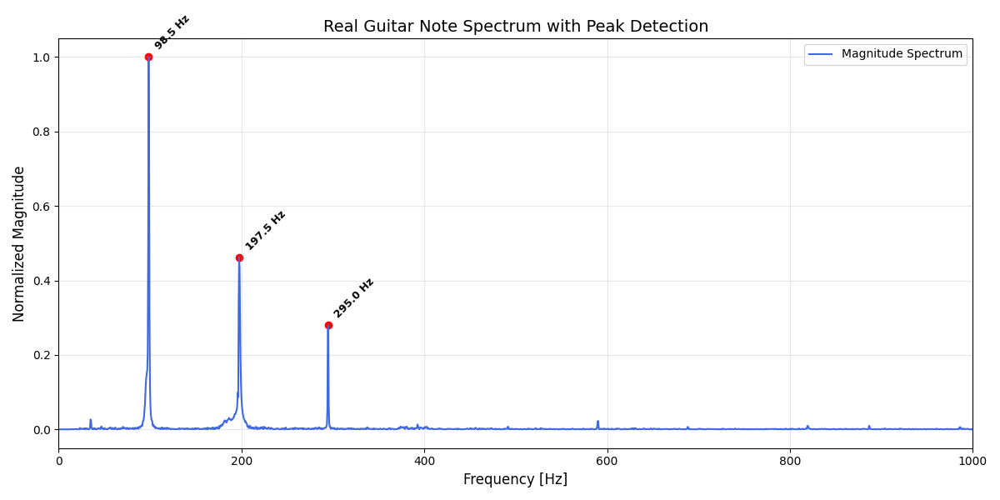
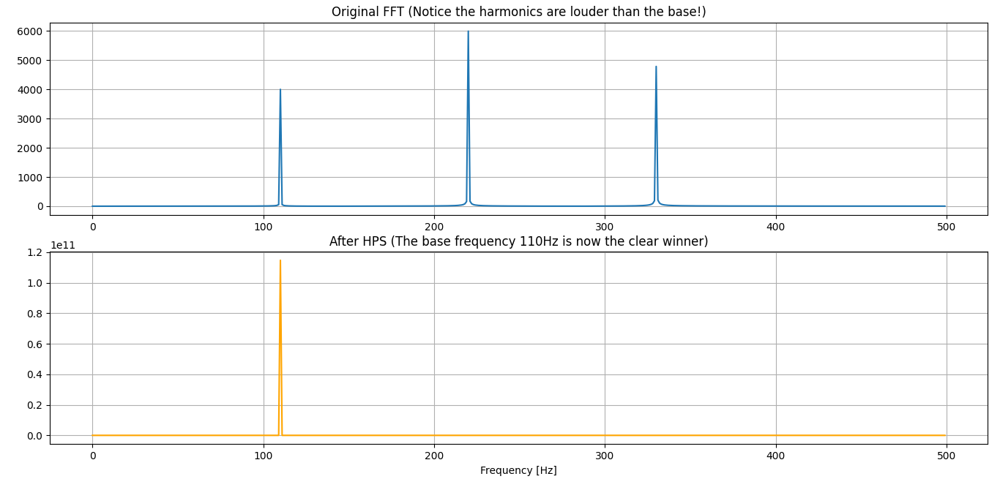

# 🎸 Real-Time Guitar Tuner (HPS-Based)

A high-precision, real-time guitar tuner implemented in Python. This project leverages Digital Signal Processing (DSP) techniques to provide accurate pitch detection even in noisy environments or with instruments rich in harmonics.

## Features
- **Real-Time Processing:** Low-latency audio analysis using the `sounddevice` library.
- **HPS Algorithm:** Robust fundamental frequency detection by suppressing misleading harmonics.
- **High Resolution:** Achieves **0.1Hz frequency resolution** through 10x Zero-Padding and FFT interpolation.
- **Octave Awareness:** Accurately distinguishes between notes in different octaves (e.g., C2 vs. C3).
- **Stabilized Output:** Implements a sliding window history to provide a steady UI display.

## How It Works
The tuner processes incoming audio through several stages:
1. **Windowing:** A Hann window is applied to reduce spectral leakage.
2. **Zero-Padding:** The signal is padded to 10x its original length to increase the frequency bin density.
3. **FFT:** Transformation into the frequency domain.
4. **HPS (Harmonic Product Spectrum):** The spectrum is multiplied by its downsampled versions, which effectively isolates the fundamental frequency from its overtones.

## Visualization of the overtones
In theory, finding a note's pitch is as simple as identifying the highest peak in the frequency spectrum. However, the guitar is a complex acoustic instrument. When a string is plucked, it vibrates not only at its fundamental frequency, but also at integer multiples of that frequency, known as harmonics or overtones:



## Visualization of the HPS Logic
The following graph demonstrates how HPS identifies the correct fundamental frequency (110Hz) even when the harmonics are physically louder in the original signal:




## **Clone the repository**
   
   ```bash
   git clone https://github.com/danieltasat-Eng/Guitar-Tuner-HPS.git
   cd Guitar-Tuner-HPS
   ```

## **Install dependencies**

   ```bash
   pip install -r requirements.txt
   ```

## **Run the tuner**

   ```bash
   python tuner.py
   ```

   Make sure microphone is on, and press Ctrl+C to stop.

## Acknowledgments
This project was inspired by the work of chciken (https://github.com/not-chciken) and his implementation of the Harmonic Product   Spectrum algorithm for guitar tuning.
